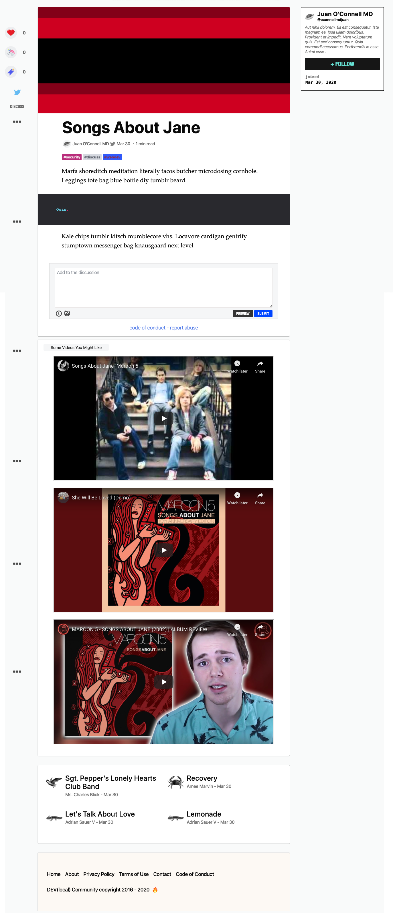

  

## Group Members

- [Jomah Fangonilo](https://github.com/jfangonilo)
- [Kim McCaskill](https://github.com/kimmccaskill)
- [Ryan Novak](https://github.com/ryan-novak)

## What is dev.to?

[dev.to](https://dev.to) (or just DEV) is a platform where software developers
write articles, take part in discussions, and build their professional profiles.
We value supportive and constructive dialogue in the pursuit of great code and
career growth for all members. The ecosystem spans from beginner to advanced
developers, and all are welcome to find their place within our community. ❤️

## Project Track : Elsewhere on the Internet

This is a project that explores an existing production code base.  We use the open source application, dev.to, to add a feature assigned by our Project Managers.  This feature track is called **Elsewhere on the Internet** which requires that:
 
> As I read through articles it would be nice to see content from other sources related to the article that I am currently reading. For each article I would like to see three potentially related YouTube videos embedded at the bottom of the page.

### Learning Goals:

- Learn and apply strategies for understanding how to analyze a large, existing code base
- Apply strategies for reading and evaluating documentation
- Explore and implement new concepts, patterns, or libraries that have not been explicitly taught while at Turing
- Practice an advanced, professional git workflow

### Wins:
- 
  
### Challenges
- 

### Future Iterations
- Implement some kind of thumbs-up/thumbs-down to mark them as actually relevant or not relevant
- Display some of the video stats (like number of views) in the preview
- Show the videos in a scrolling carousel as a way to display more than three videos
